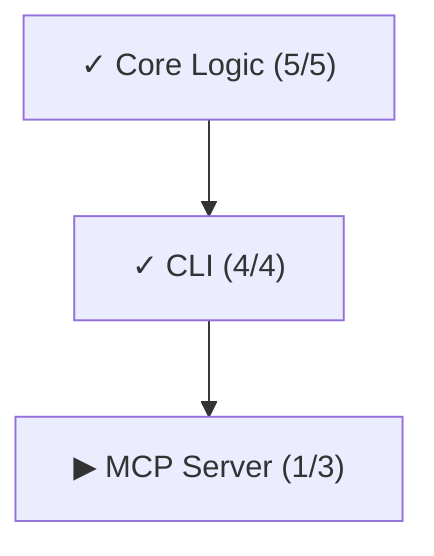

# vectl — DAG-enforced todo list for AI agents

[中文文档](README_zh.md) | [**Read the Introduction**](https://tefx.one/posts/vectl-intro/)

TODO.md can't say no. vectl can.

[](https://pypi.org/project/vectl/)

```bash
uvx vectl --help
```

## Why vectl?

| Passive Markdown Plans | vectl |
| :--- | :--- |
| ❌ **Token explosion**: Agents re-read the entire plan every call — finished steps included | ✅ `next` returns only actionable steps |
| ❌ **State drift**: Multiple agents edit the same file — silent overwrites, stale state | ✅ CAS-safe atomic writes — conflicts detected, never silent |
| ❌ **No ordering**: Agents pick what to work on — dependencies skipped, work duplicated | ✅ DAG-enforced execution — blocked steps are invisible |
| ❌ **No verification**: "Done" = a checkbox ticked, no proof | ✅ Evidence required on completion |
| ❌ **Context pollution**: Completed steps stay in context forever, diluting attention | ✅ Agents see only what matters now |

## The Agent Control Plane

vectl turns a passive "todo list" into an **active control plane** for autonomous agents.

| Feature | Problem Solved | Mechanism |
| :--- | :--- | :--- |
| **Active Gating** | Agents skip dependencies or "guess" order. | **DAG Enforcement**: Blocked steps are invisible. Agents literally *cannot* claim out-of-order work. |
| **Context Efficiency** | Agents re-read 500 lines of "Done" items. | **View Filtering**: `vectl next` returns *only* actionable steps. Zero token waste. |
| **Anti-Hallucination** | Agents declare "Done" without checking. | **Evidence Protocol**: Completion requires proof (logs, screenshots) via `evidence_template`. |
| **State Consistency** | Parallel agents overwrite `TODO.md`. | **CAS Atomic Writes**: File-based locking ensures no race conditions. |


## Quick Start

### 1. Initialize

```bash
uvx vectl init --project my-project
```

This creates `plan.yaml` and adds a vectl section to your `AGENTS.md` (creates one if needed).

### 2. Connect Your Agent

<details>
<summary>⚡ Claude Desktop / Cursor</summary>

```json
{
  "mcpServers": {
    "vectl": {
      "command": "uvx",
      "args": ["vectl", "mcp"],
      "env": { "VECTL_PLAN_PATH": "/absolute/path/to/plan.yaml" }
    }
  }
}
```
</details>

<details>
<summary>⚡ OpenCode</summary>

Add to your `opencode.jsonc`:

```jsonc
{
  "mcp": {
    "vectl": {
      "type": "local",
      "command": ["uvx", "vectl", "mcp"],
      "environment": { "VECTL_PLAN_PATH": "/absolute/path/to/plan.yaml" }
    }
  }
}
```
See [OpenCode MCP docs](https://opencode.ai/docs/mcp-servers/) for details.
</details>

<details>
<summary>⌨️ CLI Only (no MCP)</summary>

No setup needed — agents call `uvx vectl ...` directly.

> **Note**: `uvx vectl init` (Step 1) already creates or updates your `AGENTS.md`.
> If you need to update it later (e.g. to enable new guidance features), run:
> ```bash
> uvx vectl agents-md
> ```

<details>
<summary>📋 AGENTS.md template (reference)</summary>

```md
<!-- VECTL:AGENTS:BEGIN -->
## Plan Tracking (vectl)

vectl tracks this repo's implementation plan as a structured `plan.yaml`:
what to do next, who claimed it, and what counts as done (with verification evidence).

Full guide: `uvx vectl guide`
Quick view: `uvx vectl status`

### Claim-time Guidance
- `uvx vectl claim` may emit a bounded Guidance block delimited by:
  - `--- VECTL:GUIDANCE:BEGIN ---`
  - `--- VECTL:GUIDANCE:END ---`
- For automation/CI: use `uvx vectl claim --no-guidance` to keep stdout clean.

### CLI vs MCP
- Source of truth: `plan.yaml` (channel-agnostic).
- If MCP is available (IDE / Claude host), prefer MCP tools for plan operations.
- Otherwise use CLI (`uvx vectl ...`).
- Evidence requirements are identical across CLI and MCP.

### Rules
- One claimed step at a time.
- Evidence is mandatory when completing (commands run + outputs + gaps).
- Spec uncertainty: leave `# SPEC QUESTION: ...` in code, do not guess.
<!-- VECTL:AGENTS:END -->
```
</details>
</details>

### 3. Migrate (Optional)

If your project already tracks work in a markdown file, issue tracker, or spreadsheet, tell your agent:

```
Read the migration guide (via `uvx vectl guide --on migration` or `vectl_guide` MCP tool).
Migrate our existing plan to plan.yaml.
Prefer MCP tools (`vectl_mutate`, `vectl_guide`) over CLI if available.
```

### 4. The Workflow

```bash
# ORIENT: Where are we?
uvx vectl status                    # Plan-wide progress dashboard

# PICK: What's available?
uvx vectl next                      # Show claimable steps

# CLAIM: I'm working on this.
uvx vectl claim <step-id> --agent me  # Lock step, get full spec + guidance

# GUIDANCE (displayed on claim):
# --- VECTL:GUIDANCE:BEGIN ---
# ... (refs, evidence template, project rules) ...
# --- VECTL:GUIDANCE:END ---

# WORK: (you write code, run tests, follow guidance)

# COMPLETE: I proved it works.
uvx vectl complete <step-id> --evidence "..." # Paste filled template here

# REPEAT: What's unlocked now?
uvx vectl next                      # See what the completion unlocked
```

Every command output ends with hints for the next action:

```
$ uvx vectl complete auth.user-model -e "commit abc: model + tests"

Completed: auth.user-model

Next available:
  ○ pending  auth.session-token — Session Token  (auth)
  ○ pending  auth.permissions — Permission Model  (auth)

→ vectl claim <id> --agent <name>
→ vectl show <id>
```

### 5. Intelligent Guidance (The "Why")

vectl allows Architects to inject **guidance** directly into the Worker's context at the moment of action.

#### A. Evidence Templates (`--evidence-template`)
Prevent "lazy completion" (e.g., "I fixed it"). Force the worker to prove success.

```bash
uvx vectl add-step ... --evidence-template "
## Verification
- Command: `pytest tests/auth/`
- Output: [Paste 5 lines of output here]
- [ ] Confirmed 0 failures
"
```

#### B. Context Pinning (`--refs`)
Stop the "needle in a haystack" search. Tell the worker exactly where to look.

```bash
uvx vectl add-step ... --refs "src/auth.py,tests/test_auth.py"
```

When the worker runs `uvx vectl claim`, they receive:
1. The Task (Step Description)
2. The Context (Pinned Refs)
3. The Standard (Evidence Template)

**This creates a "Success Pit"**: The easiest path for the agent is the correct one.

### 7. Authoring & Guidance

**No Manual YAML Edits**: Use CLI/MCP commands to build the plan safely.

```bash
# Add a step with an evidence template
uvx vectl add-step --phase core --name "Auth" --evidence-template "Verif:\n- [ ] Login works"

# Update project-level guidance (rules for all steps)
uvx vectl edit-plan --project-guidance "Always verify with pytest."
# OR read from a file (recommended for long rules)
uvx vectl edit-plan --project-guidance-file docs/rules.md
```

### 8. Context Injection (Compaction & Handoff)

For agents needing to pass state (e.g. context window compaction or sub-agent handoff), use `checkpoint` to get a machine-readable, token-efficient snapshot.

```bash
uvx vectl checkpoint --lite
```

**Output (JSON):**
```json
{
  "schema": "vectl.checkpoint/v1",
  "focus": { "step_id": "auth.01", "status": "claimed" },
  "next": [{ "step_id": "auth.02", "name": "Implement Token" }],
  "blockers": ["auth.01 depends_on core.05"]
}
```

This JSON is designed to be injected directly into an LLM's system prompt as the "Ground Truth".

### 9. Visualization

See the DAG structure (output is Mermaid flowchart text, paste into GitHub/Obsidian to render):

```bash
uvx vectl dag              # High-level phase DAG (default)
uvx vectl dag --phase core # Detailed step DAG within a phase
```

Output example (renders natively in GitHub):



For all 34 commands (plan mutation, review, admin): `uvx vectl --help` or `uvx vectl guide`.

### Human Oversight

```bash
uvx vectl render                    # Export plan as markdown
uvx vectl diff                      # Changes since last commit
uvx vectl log --last 5              # Recent plan mutations
```

## Data Model (`plan.yaml`)

```yaml
version: 1
project: my-project
phases:
  - id: auth
    name: Auth Module
    depends_on: [core]
    steps:
      - id: auth.user-model
        name: User Model
        status: claimed
        claimed_by: engineer-1
```

Full schema, ID rules, and ordering semantics: [docs/DESIGN.md](docs/DESIGN.md).

## Technical Details

Architecture, CAS safety, and test coverage: [docs/DESIGN.md](docs/DESIGN.md).
