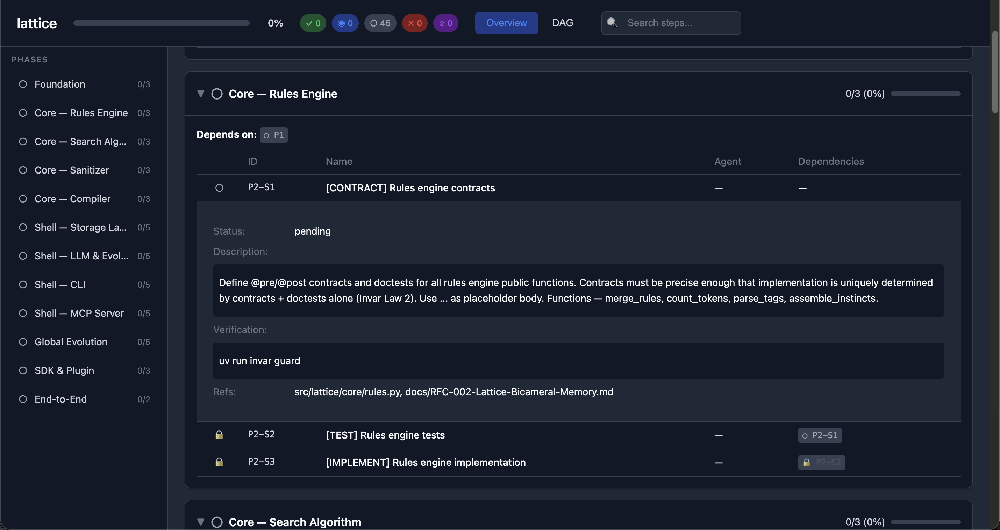

# vectl — execution control plane for AI agents

[中文文档](README_zh.md) | [**Read the Introduction**](https://tefx.one/posts/vectl-intro/)

**Structure agents. Save tokens.**

[](https://pypi.org/project/vectl/)

```bash
uvx vectl --help
```

## Your Markdown Plan Is Wasting Tokens

A 50-step markdown plan, 40 steps done:

- The agent still **re-reads all 50 lines**. 40 completed steps are pure noise — eating context window, burning attention, costing you money.
- `vectl next` **returns only 3 actionable steps**. Completed steps vanish. Blocked steps are invisible.

The more steps you have, the worse it gets. 100 steps, 90 done? Markdown forces the agent to read 100 lines to find 10 useful ones. vectl gives it just those 10.

And Markdown is linear. Three agents online at once? They queue up — because nothing tells them which steps can run in parallel.
vectl's DAG makes parallelism possible: dependencies are explicit, `next` serves up **all** unblocked steps, three agents each claim one, zero conflicts.

Token waste and serialization are just symptoms. The root defect is that **Markdown doesn't express dependencies**:

| Markdown Plans | vectl |
| :--- | :--- |
| ❌ **Full re-read every time**: agent reads all steps regardless of completion | ✅ Returns only actionable steps — done steps vanish |
| ❌ **Implicit dependencies**: "Deploy DB" before "Config App" — agent can only guess if they're related | ✅ `depends_on: [db.deploy]` — explicit, no guessing |
| ❌ **No safe parallelism**: without dependency info, multiple agents queue up or gamble | ✅ DAG makes parallelism computable — `next` returns all conflict-free steps |
| ❌ **Manual dispatch**: "DB is done, go work on App now" | ✅ `next` automatically surfaces all unblocked steps |
| ❌ **Silent overwrites**: two agents write the same file simultaneously | ✅ CAS optimistic locking — conflicts error out, never silently lost |
| ❌ **Self-declared completion**: agent says "Done" and it's Done | ✅ Evidence required: what command, what output, where's the PR |
| ❌ **Context amnesia**: new session = start from scratch | ✅ `checkpoint` generates a state snapshot — inject into new session, instant recovery |

> TODO.md can't say no. vectl can.

## Control Plane, Not a Framework

Agent frameworks manage how agents think. vectl manages **what agents see, when they see it, and what they must prove**.

| Capability | Problem Solved | Mechanism |
| :--- | :--- | :--- |
| **DAG Enforcement** | Agents skip dependencies, guess ordering | Blocked steps are invisible — agents literally *cannot* claim them |
| **Safe Parallelism** | Multiple agents step on each other | `claim` locking + CAS atomic writes |
| **Auto-Dispatch** | Someone must watch and assign tasks | `next` computes all unblocked steps and sorts them; rejected steps float to top |
| **Token Budget** | Agent re-reads hundreds of completed lines | Hard limits across the board: next ≤3, context ≤120 chars, evidence ≤900 chars |
| **Anti-Hallucination** | Agent says "Fixed" and moves on | `evidence_template` forces fill-in-the-blank proof: command, output, PR link |
| **Context Compaction** | Long conversations cause agent amnesia | `checkpoint` generates a deterministic JSON snapshot — inject into new session for instant recovery |
| **Handoff Notes** | Agents lose state between hosts/sessions | `clipboard-write/read/clear` stores short notes in `plan.yaml` (with TTL) |
| **Agent Affinity** | Different agents are good at different tasks | Steps can suggest an agent; `next` sorts by affinity |

## Quick Start

### 1. Initialize

```bash
uvx vectl init --project my-project
```

Creates `plan.yaml` and auto-configures agent instructions (writes `CLAUDE.md` when `.claude/` directory is detected, otherwise `AGENTS.md`).

> Commit `plan.yaml` + `AGENTS.md`/`CLAUDE.md` together. The plan is the state machine; the instructions file is the agent entry point.

### 2. Connect Your Agent

<details>
<summary>⚡ Claude Desktop / Cursor</summary>

```json
{
  "mcpServers": {
    "vectl": {
      "command": "uvx",
      "args": ["vectl", "mcp"],
      "env": { "VECTL_PLAN_PATH": "/absolute/path/to/plan.yaml" }
    }
  }
}
```
</details>

<details>
<summary>⚡ OpenCode</summary>

Add to your `opencode.jsonc`:

```jsonc
{
  "mcp": {
    "vectl": {
      "type": "local",
      "command": ["uvx", "vectl", "mcp"],
      "environment": { "VECTL_PLAN_PATH": "/absolute/path/to/plan.yaml" }
    }
  }
}
```
See [OpenCode MCP docs](https://opencode.ai/docs/mcp-servers/) for details.
</details>

<details>
<summary>⌨️ CLI Only (no MCP)</summary>

No setup needed — agents call `uvx vectl ...` directly.

> `uvx vectl init` already creates/updates the agent instructions file.
> To update later: `uvx vectl agents-md` (use `--target claude` if needed).
</details>

#### Agent Instruction Files

`vectl init` and `vectl agents-md` manage the agent instruction file in your repo.

That file is the *entry point* for agents: it points to `uvx vectl guide` topics and sets the rules (one claimed step at a time, evidence required, don't guess specs).

```bash
uvx vectl agents-md                 # Update AGENTS.md / CLAUDE.md with vectl section
uvx vectl agents-md --target claude # Force CLAUDE.md
```

### 3. Migrate (Optional)

If your project already tracks work in a markdown file, issue tracker, or spreadsheet, tell your agent:

```
Read the migration guide (via `uvx vectl guide --on migration` or `vectl_guide` MCP tool).
Migrate our existing plan to plan.yaml.
Prefer MCP tools (`vectl_mutate`, `vectl_guide`) over CLI if available.
```

### 4. The Workflow

Keep it simple:

```bash
uvx vectl status                               # Where are we?
uvx vectl next                                 # What can run now?
uvx vectl claim <step-id> --agent <name>       # Get spec + pinned refs + evidence template
uvx vectl complete <step-id> --evidence "..."  # Prove it (paste filled template)
```

### 5. Dashboard (Static HTML)

Generate a single-file HTML dashboard (Overview + DAG) for quick visual inspection:

```bash
uvx vectl dashboard --open

# Or write to a custom path
uvx vectl dashboard --out /tmp/plan-dashboard.html
```



Notes:
- Output is a local HTML file (no server).
- The DAG view loads Mermaid.js from a CDN (network required for that tab).

Everything else is in the guide:

- Architect protocol: `uvx vectl guide --on planning`
- Getting unstuck: `uvx vectl guide --on stuck`
- Review / validation: `uvx vectl guide --on review`
- Migration: `uvx vectl guide --on migration`

## Handoffs: Clipboard (Notes) vs Checkpoint (State)

If you're switching agent hosts (Claude Code ↔ Cursor ↔ OpenCode) or handing work between agents, use both:

- **Clipboard**: short, human-readable notes that live in `plan.yaml` (with TTL).
- **Checkpoint**: compact, machine-readable state snapshot for context injection.

### Clipboard (recommended for handoffs)

Use this when you want to pass **actionable notes** between agent hosts/sessions without creating extra files.

Example: Claude Code did a detailed code review, found a few small issues, and you want OpenCode (GLM-5) to patch them.
Drop the review notes into the clipboard — the other agent reads and applies.

```bash
uvx vectl clipboard-write \
  --author "claude-code" \
  --summary "Code review: small fixes" \
  --content "
Target: src/foo.py

Issues:
- Rename X to Y (see comment in function bar)
- Add missing test for edge case Z
- Run: uv run pytest tests/test_foo.py
"

uvx vectl clipboard-read
uvx vectl clipboard-clear
```

MCP equivalent:

```python
vectl_clipboard(action="write", author="claude-code", summary="Code review: small fixes", content="...")
vectl_clipboard(action="read")
vectl_clipboard(action="clear")
```

### Checkpoint

```bash
uvx vectl checkpoint
```

Paste the JSON into the next session's system prompt.

## Data Model (`plan.yaml`)

```yaml
version: 1
project: my-project
phases:
  - id: auth
    name: Auth Module
    context: |
      All auth steps must follow OWASP guidelines.
      Test with both valid and malformed JWTs.
    depends_on: [core]
    steps:
      - id: auth.user-model
        name: User Model
        status: claimed
        claimed_by: engineer-1
```

A YAML file. In your git repo.

No database. No SaaS. `git blame` it. Review it in PRs. `git diff` it.

**Phase Context**: Set `context` on a phase to give agents guidance that applies to all steps within it. When an agent runs `vectl show <step>` or `vectl claim`, phase context appears automatically in the output.

Full schema, ID rules, and ordering semantics: [docs/DESIGN.md](docs/DESIGN.md).

## Technical Details

Architecture, CAS safety, and test coverage (658 tests, Hypothesis state machine verification): [docs/DESIGN.md](docs/DESIGN.md).
