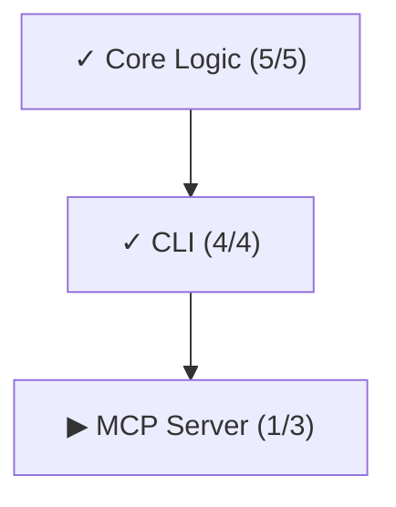

# vectl — execution control plane for AI agents

[中文文档](README_zh.md) | [**Read the Introduction**](https://tefx.one/posts/vectl-intro/)

**Structure agents. Save tokens.**

[](https://pypi.org/project/vectl/)

```bash
uvx vectl --help
```

## Your Markdown Plan Is Wasting Tokens

A 50-step markdown plan, 40 steps done:

- The agent still **re-reads all 50 lines**. 40 completed steps are pure noise — eating context window, burning attention, costing you money.
- `vectl next` **returns only 3 actionable steps**. Completed steps vanish. Blocked steps are invisible.

The more steps you have, the worse it gets. 100 steps, 90 done? Markdown forces the agent to read 100 lines to find 10 useful ones. vectl gives it just those 10.

And Markdown is linear. Three agents online at once? They queue up — because nothing tells them which steps can run in parallel.
vectl's DAG makes parallelism possible: dependencies are explicit, `next` serves up **all** unblocked steps, three agents each claim one, zero conflicts.

Token waste and serialization are just symptoms. The root defect is that **Markdown doesn't express dependencies**:

| Markdown Plans | vectl |
| :--- | :--- |
| ❌ **Full re-read every time**: agent reads all steps regardless of completion | ✅ Returns only actionable steps — done steps vanish |
| ❌ **Implicit dependencies**: "Deploy DB" before "Config App" — agent can only guess if they're related | ✅ `depends_on: [db.deploy]` — explicit, no guessing |
| ❌ **No safe parallelism**: without dependency info, multiple agents queue up or gamble | ✅ DAG makes parallelism computable — `next` returns all conflict-free steps |
| ❌ **Manual dispatch**: "DB is done, go work on App now" | ✅ `next` automatically surfaces all unblocked steps |
| ❌ **Silent overwrites**: two agents write the same file simultaneously | ✅ CAS optimistic locking — conflicts error out, never silently lost |
| ❌ **Self-declared completion**: agent says "Done" and it's Done | ✅ Evidence required: what command, what output, where's the PR |
| ❌ **Context amnesia**: new session = start from scratch | ✅ `checkpoint` generates a state snapshot — inject into new session, instant recovery |

> TODO.md can't say no. vectl can.

## Control Plane, Not a Framework

Agent frameworks manage how agents think. vectl manages **what agents see, when they see it, and what they must prove**.

| Capability | Problem Solved | Mechanism |
| :--- | :--- | :--- |
| **DAG Enforcement** | Agents skip dependencies, guess ordering | Blocked steps are invisible — agents literally *cannot* claim them |
| **Safe Parallelism** | Multiple agents step on each other | `claim` locking + CAS atomic writes |
| **Auto-Dispatch** | Someone must watch and assign tasks | `next` computes all unblocked steps and sorts them; rejected steps float to top |
| **Token Budget** | Agent re-reads hundreds of completed lines | Hard limits across the board: next ≤3, context ≤120 chars, evidence ≤900 chars |
| **Anti-Hallucination** | Agent says "Fixed" and moves on | `evidence_template` forces fill-in-the-blank proof: command, output, PR link |
| **Context Compaction** | Long conversations cause agent amnesia | `checkpoint` generates a deterministic JSON snapshot — inject into new session for instant recovery |
| **Agent Affinity** | Different agents are good at different tasks | Steps can suggest an agent; `next` sorts by affinity |

## Quick Start

### 1. Initialize

```bash
uvx vectl init --project my-project
```

Creates `plan.yaml` and auto-configures agent instructions (writes `CLAUDE.md` when `.claude/` directory is detected, otherwise `AGENTS.md`).

### 2. Connect Your Agent

<details>
<summary>⚡ Claude Desktop / Cursor</summary>

```json
{
  "mcpServers": {
    "vectl": {
      "command": "uvx",
      "args": ["vectl", "mcp"],
      "env": { "VECTL_PLAN_PATH": "/absolute/path/to/plan.yaml" }
    }
  }
}
```
</details>

<details>
<summary>⚡ OpenCode</summary>

Add to your `opencode.jsonc`:

```jsonc
{
  "mcp": {
    "vectl": {
      "type": "local",
      "command": ["uvx", "vectl", "mcp"],
      "environment": { "VECTL_PLAN_PATH": "/absolute/path/to/plan.yaml" }
    }
  }
}
```
See [OpenCode MCP docs](https://opencode.ai/docs/mcp-servers/) for details.
</details>

<details>
<summary>⌨️ CLI Only (no MCP)</summary>

No setup needed — agents call `uvx vectl ...` directly.

> `uvx vectl init` already creates/updates the agent instructions file.
> To update later: `uvx vectl agents-md` (use `--target claude` if needed).
</details>

### 3. Migrate (Optional)

If your project already tracks work in a markdown file, issue tracker, or spreadsheet, tell your agent:

```
Read the migration guide (via `uvx vectl guide --on migration` or `vectl_guide` MCP tool).
Migrate our existing plan to plan.yaml.
Prefer MCP tools (`vectl_mutate`, `vectl_guide`) over CLI if available.
```

### 4. The Workflow

```bash
# ORIENT: Where are we?
uvx vectl status                    # Plan-wide progress dashboard

# PICK: What's available?
uvx vectl next                      # Show claimable steps

# CLAIM: I'm working on this.
uvx vectl claim <step-id> --agent me  # Lock step, get full spec + guidance

# GUIDANCE (displayed on claim):
# --- VECTL:GUIDANCE:BEGIN ---
# ... (refs, evidence template, project rules) ...
# --- VECTL:GUIDANCE:END ---

# WORK: (you write code, run tests, follow guidance)

# COMPLETE: I proved it works.
uvx vectl complete <step-id> --evidence "..." # Paste filled template here

# REPEAT: What's unlocked now?
uvx vectl next                      # See what the completion unlocked
```

Every command output ends with hints for the next action:

```
$ uvx vectl complete auth.user-model -e "commit abc: model + tests"

Completed: auth.user-model

Next available:
  ○ pending  auth.session-token — Session Token  (auth)
  ○ pending  auth.permissions — Permission Model  (auth)

→ vectl claim <id> --agent <name>
→ vectl show <id>
```

### 5. The "Success Pit"

Architects embed guidance at plan design time. Agents receive it automatically when they claim a step.

#### Evidence Templates (Anti-Hallucination)

Don't let agents say "I fixed it." Force them to prove it:

```bash
uvx vectl add-step ... --evidence-template "
## Verification
- Command: `pytest tests/auth/`
- Output: [Paste 5 lines of output here]
- [ ] Confirmed 0 failures
"
```

#### Context Pinning (Save Tokens)

Stop the "needle in a haystack" search. Tell the agent exactly where to look:

```bash
uvx vectl add-step ... --refs "src/auth.py,tests/test_auth.py"
```

When the agent claims, it receives: **Task** (description) + **Context** (pinned refs) + **Standard** (evidence template).

### 6. Context Compaction

Conversation too long? Agent handoff? `checkpoint` generates a minimal state snapshot:

```bash
uvx vectl checkpoint --lite
```

```json
{
  "schema": "vectl.checkpoint/v1",
  "focus": { "step_id": "auth.01", "name": "Implement Login", "status": "claimed" },
  "next": [{ "step_id": "auth.02", "name": "Implement Token" }]
}
```

Inject this JSON into a new session's system prompt. The agent resumes instantly. Zero loss.

### 7. Visualization

```bash
uvx vectl dag              # High-level phase DAG (default)
uvx vectl dag --phase core # Detailed step DAG within a phase
```



For all 34 commands (plan mutation, review, admin): `uvx vectl --help` or `uvx vectl guide`.

### Human Oversight

```bash
uvx vectl render                    # Export plan as markdown
uvx vectl diff                      # Changes since last commit
uvx vectl log --last 5              # Recent plan mutations
```

## Data Model (`plan.yaml`)

```yaml
version: 1
project: my-project
phases:
  - id: auth
    name: Auth Module
    depends_on: [core]
    steps:
      - id: auth.user-model
        name: User Model
        status: claimed
        claimed_by: engineer-1
```

A YAML file. In your git repo.

No database. No SaaS. `git blame` it. Review it in PRs. `git diff` it.

Full schema, ID rules, and ordering semantics: [docs/DESIGN.md](docs/DESIGN.md).

## Technical Details

Architecture, CAS safety, and test coverage (658 tests, Hypothesis state machine verification): [docs/DESIGN.md](docs/DESIGN.md).
