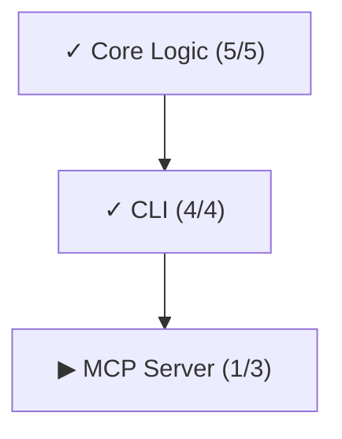

# vectl — AI Agent 的执行控制面

[English](README.md) | [**介绍文章**](https://tefx.one/posts/vectl-intro/)

**约束 agent 行为，压缩 agent 开销。**

[](https://pypi.org/project/vectl/)

```bash
uvx vectl --help
```

## 你的 Markdown 计划正在浪费 Token

一个 50 步的 markdown 计划，完成 40 步后：

- Agent 仍然**逐行重读全部 50 条**。40 条已完成的步骤是纯噪音——占 context window、消耗 attention、花你的钱。
- `vectl next` **只返回 3 条可执行的步骤**。完成的消失，被阻塞的不可见。

步骤越多，差距越大。100 步做完 90 步？Markdown 强迫 agent 读 100 行来找 10 行有用的。vectl 只给它那 10 行。

而且 Markdown 是线性的。三个 agent 同时在线？它们只能排队——因为没有任何信息告诉它们哪些步骤可以并行。
vectl 的 DAG 让并行成为可能：依赖关系是显式的，`next` 自动吐出**所有**已解锁的步骤，三个 agent 各领一个，互不冲突。

Token 浪费和无法并行只是表面症状。Markdown 的根本缺陷是**它不表达依赖关系**：

| Markdown 计划 | vectl |
| :--- | :--- |
| ❌ **每次全量读取**：不管做完多少，agent 都重读所有步骤 | ✅ 只返回可执行的步骤，完成即消失 |
| ❌ **隐式依赖**："部署 DB"写在"配置 App"前面，agent 只能猜它们有没有关系 | ✅ `depends_on: [db.deploy]` —— 显式声明，不猜 |
| ❌ **无法并行**：没有依赖信息，多 agent 只能排队或赌运气 | ✅ DAG 让并行可计算——`next` 返回所有无依赖冲突的步骤，多 agent 各领一个 |
| ❌ **人工调度**："DB 好了，你去搞 App 吧" | ✅ `next` 自动吐出所有已解锁的步骤 |
| ❌ **静默覆盖**：两个 agent 同时写同一个文件 | ✅ CAS 乐观锁 —— 冲突报错，不会静默丢失 |
| ❌ **自我宣布完成**：agent 说 "Done" 就是 Done | ✅ 必须提交证据：跑了什么命令、输出是什么、PR 在哪 |
| ❌ **对话太长就失忆**：换个会话一切从零开始 | ✅ `checkpoint` 一键生成状态快照，注入新会话即可恢复 |

> TODO.md 没法说"不"。vectl 可以。

## 控制面，不是框架

Agent 框架管 agent 怎么想。vectl 管 **agent 看到什么、什么时候看到、必须证明什么**。

| 能力 | 解决什么 | 怎么做 |
| :--- | :--- | :--- |
| **DAG 强制执行** | Agent 跳依赖、猜顺序 | 被阻塞的步骤对 agent 不可见，物理上无法领取 |
| **安全并行** | 多 agent 互踩 | `claim` 锁定 + CAS 原子写入 |
| **自动调度** | 需要人盯着分配任务 | `next` 自动计算已解锁步骤并排序；rejected 自动浮顶 |
| **Token 预算** | Agent 重读大量已完成内容 | 全链路上限：next ≤3 条、context ≤120 字符、evidence ≤900 字符 |
| **反幻觉** | Agent 说 "Fixed" 就完事了 | `evidence_template` 填空式证明：命令、输出、PR 链接 |
| **上下文压缩** | 对话超长导致 agent 失忆 | `checkpoint` 生成确定性 JSON 快照，注入新会话即刻恢复 |
| **Agent 亲和** | 不同 agent 擅长不同任务 | 步骤可标记建议 agent，`next` 按亲和度排序 |

## 快速开始

### 1. 初始化

```bash
uvx vectl init --project my-project
```

创建 `plan.yaml` 并自动配置 agent 指令文件（检测到 `.claude/` 目录时写 `CLAUDE.md`，否则写 `AGENTS.md`）。

### 2. 连接 Agent

<details>
<summary>⚡ Claude Desktop / Cursor</summary>

```json
{
  "mcpServers": {
    "vectl": {
      "command": "uvx",
      "args": ["vectl", "mcp"],
      "env": { "VECTL_PLAN_PATH": "/absolute/path/to/plan.yaml" }
    }
  }
}
```
</details>

<details>
<summary>⚡ OpenCode</summary>

```jsonc
{
  "mcp": {
    "vectl": {
      "type": "local",
      "command": ["uvx", "vectl", "mcp"],
      "environment": { "VECTL_PLAN_PATH": "/absolute/path/to/plan.yaml" }
    }
  }
}
```
参考 [OpenCode MCP 文档](https://opencode.ai/docs/mcp-servers/)。
</details>

<details>
<summary>⌨️ 纯 CLI（不用 MCP）</summary>

不需要额外配置，agent 直接调用 `uvx vectl ...`。

> `uvx vectl init` 已自动创建/更新 agent 指令文件。
> 后续更新：`uvx vectl agents-md`（可指定 `--target claude`）。
</details>

### 3. 迁移已有计划（可选）

如果项目已有 markdown / issue / spreadsheet 计划：

```
阅读迁移指南（`uvx vectl guide --on migration` 或 MCP 的 `vectl_guide` 工具）。
把现有计划迁移到 plan.yaml。
优先使用 MCP 工具（`vectl_mutate`、`vectl_guide`）。
```

### 4. 工作流

```bash
# 定位：做到哪了？
uvx vectl status                    # 全局进度

# 选择：哪些可以做？
uvx vectl next                      # 列出可领取的步骤（依赖已就绪的）

# 领取：我来做这个
uvx vectl claim <step-id> --agent me  # 锁定步骤，获取指导

# 指导（领取时自动注入）：
# --- VECTL:GUIDANCE:BEGIN ---
# 相关文件（refs）、evidence template、项目规则
# --- VECTL:GUIDANCE:END ---

# 执行：写代码、跑测试

# 完成：证明它能用
uvx vectl complete <step-id> --evidence "..."

# 循环：看看解锁了什么
uvx vectl next
```

每个命令输出结尾都有下一步提示：

```
$ uvx vectl complete auth.user-model -e "commit abc: model + tests"

Completed: auth.user-model

Next available:
  ○ pending  auth.session-token — Session Token  (auth)
  ○ pending  auth.permissions — Permission Model  (auth)

→ vectl claim <id> --agent <name>
→ vectl show <id>
```

### 5. 让 Agent 掉进"成功陷阱"

Architect 设计计划时预埋指导，Agent 领取任务时自动注入上下文。

#### Evidence Template（反幻觉）

不让 agent 说"我修好了"。强制填空：

```bash
uvx vectl add-step ... --evidence-template "
## 验证
- 命令: `pytest tests/auth/`
- 输出: [粘贴 5 行]
- [ ] 确认 0 failures
"
```

#### Context Pinning（省 token）

不让 agent 满项目找文件。告诉它看哪里：

```bash
uvx vectl add-step ... --refs "src/auth.py,tests/test_auth.py"
```

领取时 agent 收到：**任务**（描述）+ **上下文**（该看哪些文件）+ **标准**（什么算完成）。

### 6. 上下文压缩

对话太长？Agent 换班？`checkpoint` 生成最小化状态快照：

```bash
uvx vectl checkpoint --lite
```

```json
{
  "schema": "vectl.checkpoint/v1",
  "focus": { "step_id": "auth.01", "name": "实现登录", "status": "claimed" },
  "next": [{ "step_id": "auth.02", "name": "实现 Token" }]
}
```

注入新会话的 system prompt，agent 立即恢复。无损。

### 7. 可视化

```bash
uvx vectl dag              # Phase 级 DAG
uvx vectl dag --phase core  # Step 级 DAG
```



全部 34 个命令：`uvx vectl --help` 或 `uvx vectl guide`。

### 人工监督

```bash
uvx vectl render                    # 导出为 Markdown
uvx vectl diff                      # 自上次 commit 以来的变更
uvx vectl log --last 5              # 最近 5 条计划变更
```

## 数据模型（`plan.yaml`）

```yaml
version: 1
project: my-project
phases:
  - id: auth
    name: Auth Module
    depends_on: [core]
    steps:
      - id: auth.user-model
        name: User Model
        status: claimed
        claimed_by: engineer-1
```

一个 YAML 文件。在你的 git repo 里。

不需要数据库。不需要 SaaS。`git blame` 能查、PR 能 review、`git diff` 能追踪。

完整 schema 和排序语义：[docs/DESIGN.md](docs/DESIGN.md)。

## 技术细节

架构、CAS 安全、测试覆盖（658 tests, Hypothesis 状态机验证）：[docs/DESIGN.md](docs/DESIGN.md)。
